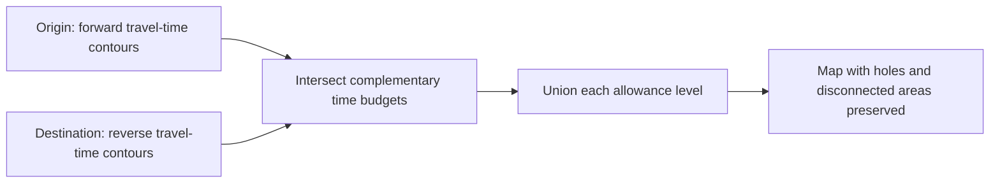

# Feasible route mapping

An interactive exploration of where a journey could pass when it has extra travel time. Choose an origin, destination, optional waypoint, travel mode and time allowance; compare the reference route with colored feasible areas.

The restored portfolio demo uses **South Australia** routing data and six modes: car, bicycle, pedestrian, truck, bus and motor scooter. Bus means road routing for a bus, not public transport schedules. Search bundled Adelaide landmarks, drag markers, or right-click the map to choose locations and roads to avoid.

**[Open the live demo](https://feasible-route-mapping-demo.pages.dev).** The bundled example opens immediately; choose “Try live routing” for real calculations. The live Render Free API passed all six modes, fractional contours up to 40 minutes, exclusions, zero-extra-time calculations and full feasible-region generation. Hosting uses isolated `msiric-public-demos` projects on Cloudflare Pages Free and Render Free; no paid infrastructure is required. See [deployment details](DEPLOYMENT.md).

## What the map means

For each route segment, the target is approximately:

`travel(origin, point) + travel(point, destination) ≤ reference route duration + extra time`



Valhalla computes the reference route using the original mode-specific preferences. Its duration is not guaranteed to be the absolute minimum travel time. The colored areas use one-minute time splits and 20 m geometric generalization; they are an approximation, can omit narrow corridors, and can be truncated at the regional boundary. Road restrictions and turn penalties also limit geometric equivalence. This portfolio demonstration is not navigation or safety advice and does not include live traffic.

The demo allows two or three locations, up to eight road exclusions, and a maximum 40-minute budget per segment including zero to ten extra minutes. Each segment's endpoints must be within 40 km straight-line distance. These bounds keep interactive use practical on a small sleeping server.

## Restoration changes

- Destination expansion uses the supported `reverse: true` API flag. The legacy `isochrone_type` parameter did not request reverse expansion.
- Requests explicitly ask for polygons and retain holes and disconnected components. Contours are batched four at a time and reused across allowance levels.
- Fractional route durations, zero extra time and sub-minute routes are handled without negative array sizes or shifted contour indices.
- Polygon work runs in a cancellable browser worker. Changed inputs cancel stale requests, and progress/error messages explain the free server's limits.
- Vite replaces the retired Create React App toolchain. The public gateway validates inputs and bounds requests, responses, cache memory, concurrency and rate.
- A pinned map extract is built into the container image. Startup performs no graph build or map download. No keep-alive job is used.

## Develop locally

Use Node 22.13 or newer in the Node 22 series, and Docker for the routing engine:

```sh
npm --prefix application ci
npm --prefix application/client ci
docker build -t feasible-route-demo .
docker run --rm --name feasible-route-demo -p 127.0.0.1:5076:10000 -e PORT=10000 -e NODE_ENV=development feasible-route-demo
```

In another terminal, run `npm --prefix application/client start` and open the printed localhost URL. Local development skips the production proxy authentication; keep the Docker port bound to loopback as shown.

Run `npm --prefix application test`, `npm --prefix application/client run typecheck`, and `npm --prefix application/client run build`. The public CI workflow also builds and exercises the actual image with 512 MB memory and 0.1 CPU limits. It exports a public synthetic example through CI logs without storing paid artifacts, publishing images, or accessing production credentials.

## Data, attribution and privacy

Map and routing data © [OpenStreetMap contributors](https://www.openstreetmap.org/copyright), licensed under ODbL 1.0. The pinned, unchanged [Geofabrik South Australia extract](https://download.geofabrik.de/australia-oceania/australia/south-australia.html) and its checksum are documented in [DATA.md](deployment/DATA.md). Routing uses [Valhalla](https://github.com/valhalla/valhalla); polygon calculations use [Turf](https://turfjs.org/).

Landmark search is local; it does not call Nominatim. Live calculations send selected coordinates to the demo server. Basemap browsing loads ordinary, cached OpenStreetMap tiles with attribution and no offline prefetch. No account, location permission or analytics is required. The hosting providers receive normal request metadata.

The original `container/` directory remains as historical infrastructure reference. The repository-root Dockerfile and [DEPLOYMENT.md](DEPLOYMENT.md) define the restored deployment.

## Hosting documentation

- [Deploy and maintain this app](DEPLOYMENT.md).
- [Portfolio ownership, costs, recovery and maintenance](https://github.com/msiric/feasible-route-mapping/blob/master/docs/PORTFOLIO_HOSTING.md).
- [Host a future project for $0](https://github.com/msiric/feasible-route-mapping/blob/master/docs/FREE_DEMO_HOSTING.md) and [copy its deployment record template](https://github.com/msiric/feasible-route-mapping/blob/master/docs/PROJECT_HOSTING_TEMPLATE.md).
