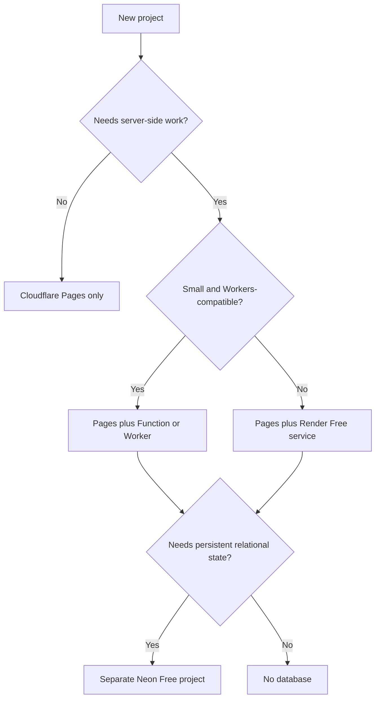

# Host another portfolio project for $0

This is the reusable playbook from the Vaxx, Vesper and Feasible Route Mapping restoration. Verified **18 September 2026**. It targets low-traffic demos with disposable data and acceptable cold starts, not production availability or a promise of permanent free plans. Current projects and provider ownership are in [PORTFOLIO_HOSTING.md](PORTFOLIO_HOSTING.md).

## 1. Choose the smallest stack

| App requirement | Starting point | Example |
| --- | --- | --- |
| Static UI, browser calculations, bundled data | Cloudflare Pages only | Portfolio, visualizer, calculator |
| Small API compatible with Workers limits | Pages plus a Pages Function/Worker; assess storage separately | Lightweight validation or lookup |
| Existing Express app, native modules or a container | Pages frontend plus one Render Free web service | Vaxx/Vesper API; Valhalla container |
| Persistent relational data | Add one isolated Neon Free project for that app | Temporary accounts/appointments |
| Always-on worker, large dataset, unbounded uploads, heavy compute or important user data | Reassess scope and hosting requirements before provisioning | Do not force into this demo design |

For these existing apps, preserving the tested Node/container code avoided a major edge-runtime rewrite. Valhalla's native routing engine and graph do not fit a small JS edge function. Future projects need not inherit all three providers. Cloudflare Workers Free currently has a 10 ms CPU limit per invocation; check runtime compatibility and measured CPU, not just request count. [Workers pricing/limits](https://developers.cloudflare.com/workers/platform/pricing/).



Before/after examples:

- Static gallery fetching legacy S3 assets → bundle licensed sample media in Pages; no API or S3 bill for browsing.
- Express app requiring login, Stripe and SMTP before anything works → immediate sample plus temporary live account; simulate external side effects explicitly.
- Routing engine building/downloading a large graph on every startup → checksum-pinned regional graph built into its image; bounded requests and a bundled example.

## 2. Record ownership before creating resources

Copy [PROJECT_HOSTING_TEMPLATE.md](PROJECT_HOSTING_TEMPLATE.md) into the new repository as `DEPLOYMENT.md`. Fill its scope, owner, allowed parents, source branch, intended names and $0 budget before creation; fill generated IDs afterward.

For Mario's portfolio demos, use the existing **dedicated** `msiric-public-demos` parents listed in the operations guide, after verifying IDs. Add a new app-specific Pages project, Render project with `Demo` environment/service if needed, and Neon project if needed. Do not reuse another app's runtime credentials or database. Do not move or rename unrelated organizations. More app projects do not increase shared Render/Cloudflare quotas; check capacity first. Do not multiply accounts to evade limits.

Suggested names: `<slug>-demo` for Pages/Neon, `<slug>` for the Render project, `<slug>-demo-api` for its service and `<slug>_demo` for PostgreSQL. Provider subdomains avoid domain purchase and DNS changes.

Record the exact Free plan, current quotas, whether a card is attached, build spending cap and the behavior at quota exhaustion. A service marked Free under a paid parent is not equivalent to an isolated zero-spend setup. Do not add payment methods, credits requiring later conversion, paid add-ons or automatic upgrades to complete this recipe.

## 3. Prepare and bound the application

- Make the landing experience useful without the API: explicit read-only sample, screenshots or browser-only calculations. Avoid API requests/polling before the visitor asks for live mode.
- Explain sleeping servers, offer progress/cancel/retry and preserve the sample on failure. Retry only bounded, safe operations; never endlessly retry writes.
- Use synthetic data, short-lived visitor sessions, ownership checks and bounded cleanup. Define upload size/type/image dimensions, account/storage/write caps, body/response limits, query deadlines, queue length and concurrency.
- Simulate email/payment interactions and label them. No production clinic, customer, card or secret data. Check media/data licensing before bundling anything.
- Persist required data in the database, not runtime disk. Bake immutable assets/graphs into the build. Bound database pools and allow idle sleep; health checks should not repeatedly query the DB or engine.
- Serve `/api/*` from the frontend's origin through a narrowly scoped proxy. Authenticate the proxy to the backend; validate Origin on browser mutations, use suitable session/CSRF protections, and derive client IP only through a trusted proxy path. A shared proxy secret is not user authentication.
- Keep secrets out of browser build variables (`VITE_*` is public). Add CSP/security headers suitable for the app. Check dependency advisories and keep lockfiles, runtime and heavy base images pinned appropriately.

Do not copy one of these proxies blindly: Vaxx/FRM accept narrow JSON requests, while Vesper also handles bounded multipart data and polling. Adapt and test the allowed methods, paths, content types, sizes and timeouts for the new application.

## 4. Provision only the needed resources

For an existing backend, create one Render **Free** web service in the new app project's `Demo` environment. Match region with its database (these examples use Frankfurt), explicitly select the intended source branch, disable automatic deployment initially, and configure `/healthz`. Use `render.yaml` as a reviewable configuration reference; inspect actual dashboard settings. Node services should build once, prune development dependencies and start compiled output. Containers should bind the platform `PORT`, run without unnecessary privileges and do expensive data preparation at build time.

If PostgreSQL is needed, create a separate project in the dedicated **Neon Free** organization. Select a compatible PostgreSQL version and matching region, use the minimum suitable compute with a fixed maximum, preserve scale-to-zero, and record the actual host/database. Apply versioned migrations and repeatable synthetic seeds, never destructive automatic synchronization. Store the connection URL only in that app's backend environment. Test TLS verification and a wrong-host/database guard.

For the frontend, choose Cloudflare Pages **Direct Upload** if you want this manual build/deploy workflow. Select the repository's intended default branch as the production label when creating a new project; unlike the restored historical apps, new projects should start with aligned branch names. Direct Upload cannot be switched in place to built-in Git integration later, although a custom CI workflow can run Wrangler. Decide before creation. [Direct Upload documentation](https://developers.cloudflare.com/pages/get-started/direct-upload/).

## 5. Build and publish with explicit targets

These are a template, not ready-to-run values. Replace all `<...>` placeholders first. Use a dedicated CLI configuration directory outside Git and an approved Wrangler version installed for the project/operator. Never rely on another account's existing global credentials.

```sh
# Set once in this deployment shell; keep these exports for every Wrangler call.
export CLOUDFLARE_ACCOUNT_ID='<verified-demo-account-id>'
export XDG_CONFIG_HOME='<absolute-private-demo-cli-directory>'

wrangler login
wrangler whoami
wrangler pages project list

# Only if the intended project does not already exist:
wrangler pages project create '<slug>-demo' --production-branch '<default-branch>'
```

Confirm login identity, exact account and existing-project inventory before creation. If a UI or command fails ambiguously, list resources again before retrying; avoid duplicates.

For apps with live backends, set Pages **production** secrets `API_ORIGIN` to the new Render HTTPS origin and `DEMO_PROXY_SECRET` to a newly generated value that also exists in that app's Render environment. Set the backend's exact frontend origin. Use the provider's secret editor or the CLI's interactive input; never paste secrets into a command argument or tracked file. Keep preview environments sample-only or give them separate test infrastructure; do not allow arbitrary preview origins against production state.

Add an app-specific `wrangler.jsonc` at repository root with `name`, `pages_build_output_dir` and a reviewed `compatibility_date`. Pages rejects `account_id` in this config; use the explicit environment variable. If using the proxy, put `functions/api/[[path]].js` at root. Ensure the generated build contains:

```json
{"version":1,"include":["/api/*"],"exclude":[]}
```

This `_routes.json` keeps static routes out of Functions. A static-only app does not need a proxy, API secrets or function routing. [Pages Functions routing](https://developers.cloudflare.com/pages/functions/routing/).

```sh
# From the repository root; adapt install/build scripts to this repository.
npm ci
npm run build
wrangler pages deploy '<actual-build-output-directory>' \
  --project-name '<slug>-demo' \
  --branch '<recorded-pages-production-branch>'
```

Nested projects may need separate root/client installs and a different build command; use their scripts, not this generic example blindly. Keep the `functions/` directory in the command's working directory. A different `--branch` can create only a preview. Set/update production secrets **before** deployment and redeploy when they change. Record the resulting production deployment ID and test the root URL, not just the preview link printed by a CLI.

## 6. Prove it works before sharing

1. Clean locked install, production build and relevant tests/type checks. For migrations, verify up/down/up and schema drift against a disposable local/CI database, never the hosted demo.
2. For native/heavy services, exercise the real image under the target memory/CPU limit. Measure peak RAM and OOMs, not just successful build output. Keep comfortable headroom; check startup, maximum allowed requests and concurrent work.
3. On the public frontend: sample, live mode, one complete operation, reload/deep link, logout/cancel, second isolated visitor and error recovery. Inspect cookies, origin/ownership controls and the browser console. Test asset loading under the deployed CSP.
4. Verify protected direct API calls fail, malformed/oversized requests are rejected and proxy traffic reaches only intended paths. Static browsing should not wake the backend/database.
5. Let the API idle naturally, then measure a real live operation. Record observed cold/warm timings as dated measurements. Confirm the sample still works while the live backend is unavailable.
6. Verify actual parent IDs, Free plans, caps and remaining quotas again. Record source commit, host versions, migrations, observations and recovery steps. Add the public URL to README and repository homepage.

Public standard GitHub-hosted Actions runners have free execution, but larger runners and storage have different billing rules. These projects' CI avoids artifact uploads, persistent build caches and production credentials. Use disposable test data, read-only job permissions and pinned actions. [GitHub Actions billing](https://docs.github.com/en/billing/concepts/product-billing/github-actions).

## 7. Operate, extend or retire

Use the [operations guide](PORTFOLIO_HOSTING.md) for maintenance, troubleshooting and rollback. Review actual monthly usage before adding another live app. Render's shared instance hours and Cloudflare's shared dynamic requests are the main portfolio-wide budgets; Neon has per-project limits. Free-plan limits and suspension are accepted tradeoffs, not an SLA. Do not add uptime pings that defeat sleep.

Start with manual releases. When updates become frequent, consider a manually triggered CI deployment using only scoped credentials, explicit parent/branch assertions and appropriate protected environments. Test source and schema compatibility, record versions and verify the public URL after each deployment. Do not change the three restored hosts simply to adopt an optional workflow.

Retirement procedure: identify exact app resources/dependencies, decide whether data needs a private export, remove the public demo link or replace it with an archive notice, disable only that app's deployment automation, and remove its verified service/Pages/database resources when deletion is authorized. Revoke its unused credentials. Do not delete shared parents or unrelated projects. Record what was removed and check bills afterward; disabling a frontend alone does not retire a backend or database.

## Definition of done

- [ ] App intent, limitations, public URL and owner documented.
- [ ] Exact parent/child IDs, branches, runtime, build/start commands and secret **names** recorded.
- [ ] Sample useful without the live API; live operation and idle wake verified.
- [ ] Quotas, $0 billing controls, test results and current host versions recorded.
- [ ] Isolation, input/ownership limits, migration safety and rollback verified.
- [ ] No secrets in Git/build output; no unrelated resources changed.
- [ ] A future maintainer can deploy, troubleshoot, recover and retire this specific app from its documentation.
