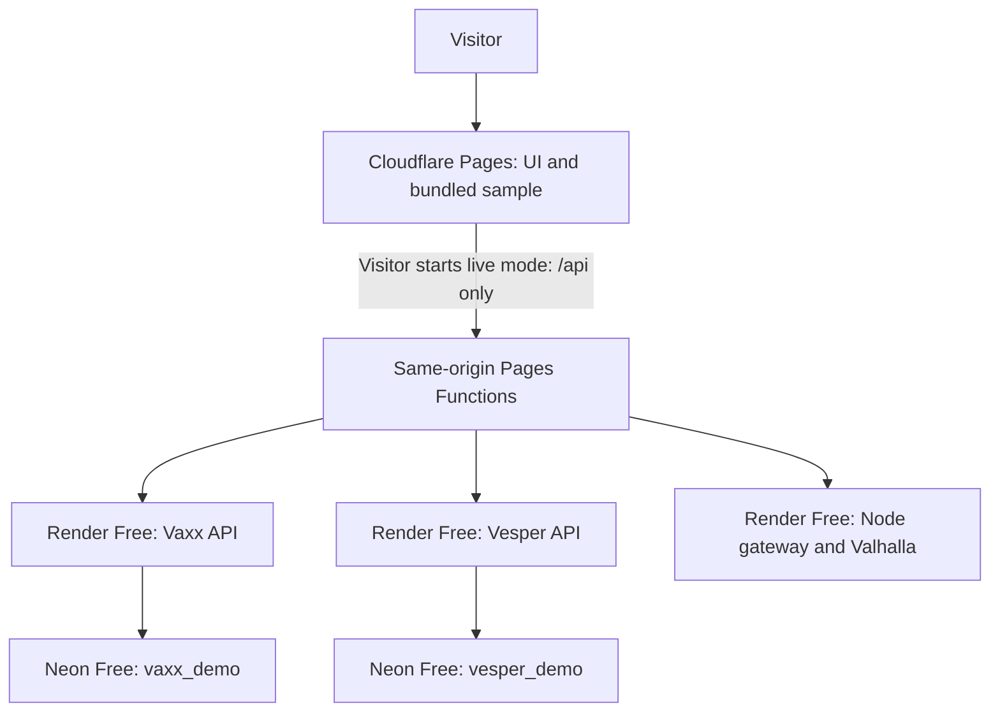

# Public demo hosting and operations

Owner: Mario Siric (`msiric`). Last verified: **18 September 2026**. Shared operations guide for [Vaxx](https://github.com/msiric/vaxx-app), [Vesper](https://github.com/msiric/vesper-art) and [Feasible Route Mapping](https://github.com/msiric/feasible-route-mapping). These are low-traffic portfolio demonstrations with a $0 paid-hosting budget.

## Are we done?

Yes, for the agreed demo scope: working public frontends and live workflows, isolated free hosting, merged source, reproducible builds and documented limits. There is no known blocking defect in the flows tested during restoration. Every possible input, future dependency release and provider change has not been validated.

The most useful remaining financial check is a **read-only audit of old AWS/Fly/Railway bills and resources**. Restoration did not cancel those resources or establish that they have stopped charging. Cleanup needs an exact resource inventory and confirmation that nothing else depends on it.

No additional architecture migration is justified by the observed demo workload. Maintain this setup and revisit the optional improvements below when their triggers occur.

## What runs where

| App | Public frontend | Live API | Persistent state |
| --- | --- | --- | --- |
| Vaxx | [Calendar](https://vaxx-app-demo.pages.dev) | `vaxx-app-demo-api.onrender.com` | Separate Neon `vaxx_demo` |
| Vesper | [Gallery](https://vesper-art-demo.pages.dev) | `vesper-art-demo-api.onrender.com` | Separate Neon `vesper_demo`, including bounded images |
| FRM | [Map](https://feasible-route-mapping-demo.pages.dev) | `feasible-route-mapping-demo-api.onrender.com` | None; graph baked into image |

The diagram groups three separate Pages projects/proxies for readability. There is no shared application backend, database or cross-app secret. Each provider has its own parent named `msiric-public-demos`; these are independent provider resources.

Samples load without the live APIs. Live mode provides progress, errors and a return to the sample. Vaxx creates a private synthetic clinic per visitor. Vesper creates temporary fictional accounts; uploads/comments can be visible to other visitors. Sessions last 24 hours; a later session creation prunes expired rows. This is not scheduled exact-time deletion. Payments/email are simulated. Do not store valuable visitor data here.

## Ownership

Use IDs as well as names, never the last selected workspace or a CLI default. Unrelated parents, projects, billing and DNS are outside this setup.

| Provider | Exact parent | Dashboard |
| --- | --- | --- |
| Cloudflare | Account `f8fd075624b85e729e46d15d374e59ed` | [Account](https://dash.cloudflare.com/f8fd075624b85e729e46d15d374e59ed/home) |
| Render | Workspace `tea-damk99ajnfac73b07010` | [Workspace](https://dashboard.render.com/w/tea-damk99ajnfac73b07010/settings) |
| Neon | Organization `org-damp-glade-19263338` | [Projects](https://console.neon.tech/app/org-damp-glade-19263338/projects) |

| App | Render project / Demo environment | Render service | Neon project |
| --- | --- | --- | --- |
| Vaxx | `prj-damk9pn40ujc73b90ei0` / `evm-damk9pn40ujc73b90ej0` | `srv-damm7jou01pc73aq1avg` | `autumn-tooth-00495173` |
| Vesper | `prj-damk9v8u01pc73aj9l50` / `evm-damk9v8u01pc73aj9l5g` | `srv-damnjj7f3r2c73al738g` | `morning-cherry-43523697` |
| FRM | `prj-damkaam7bikc73bvqcrg` / `evm-damkaam7bikc73bvqcs0` | `srv-damnkcqd0e5s73d1qc40` | Not needed |

App `DEPLOYMENT.md`, `render.yaml` and `wrangler.jsonc` files hold configuration. A manifest does not prove a dashboard service is synchronized with it. Inspect the existing service before deployment; do not blindly apply a blueprint and create duplicates.

## Cost and capacity

The new resources cost $0 within allowances. No card, paid upgrade, disk or domain was added. Render build spending is capped at $0, auto-deploy is Off, and Neon is Free. This says nothing about unrelated accounts' bills.

| Meter | Scope and recorded allowance | Operating rule |
| --- | --- | --- |
| Render active time | 750 instance-hours/month shared by this workspace | All three APIs must be allowed to sleep |
| Render bandwidth / builds | Dashboard recorded 5 GB / 500 minutes per month | Recheck actual workspace allowance before expanding |
| Render runtime | Each service: Free, Frankfurt, 512 MB / 0.1 CPU | Bound requests, memory and concurrency |
| Cloudflare API proxy | Workers Free: 100,000 dynamic requests/day shared across account Workers/Functions | `_routes.json` invokes Functions only for `/api/*` |
| Neon | Published Free: 100 CU-hours and 5 GB transfer/project/month; 0.5 GB standing storage cap/project | Both endpoints fixed at 0.25 CU with idle suspension |

Render sleeps after 15 idle minutes. Instance-hour exhaustion suspends Free services; without a card, bandwidth exhaustion also suspends them. A build cap blocks new builds, preserving the current deployment. Runtime files disappear on sleep/restart/redeploy. Free Render PostgreSQL expires after 30 days; our databases use Neon. [Render Free behavior](https://render.com/docs/free).

Cloudflare static requests that do not invoke Functions are free and unlimited; dynamic requests have a separate allowance. [Pages pricing](https://developers.cloudflare.com/pages/functions/pricing/). Neon Free suspends compute on compute/network exhaustion, restricts storage growth at the cap and does not bill Free-plan overages. Confirm the account's actual plan. [Neon Free quotas](https://github.com/neondatabase/website/blob/main/content/faqs/free-plan-limits-and-quotas.md).

Capacity examples, not forecasts:

- Three always-active APIs in a 30-day month use `3 × 720 = 2,160` hours, exceeding 750. A new service does not add workspace hours. A short request can keep a service awake afterward; inspect actual usage.
- At 0.25 CU, 100 CU-hours gives roughly `100 / 0.25 = 400` active database hours per project. Small compute still needs idle suspension.
- Proxy authentication blocks unauthorized API work, but requests can still reach/wake the public Render service. Limits are not a guarantee against deliberate quota exhaustion.

Samples remain available when **our live APIs** sleep or hit quotas, subject to frontend-provider availability. FRM background tiles still depend on OpenStreetMap. No artificial keep-alive or automatic paid fallback is configured.

## Branches and deployed versions

**Merging source does not publish either host.** Backends follow retained restoration branches with auto-deploy Off. Pages uses Direct Upload; its production label can differ from the GitHub default.

| App | GitHub default | Render branch | Pages production `--branch` | Pages deployment | API commit |
| --- | --- | --- | --- | --- | --- |
| Vaxx | `main` | `codex/restore-public-demo` | `main` | `daa75d78` | `2a991070935184b486b3df1933432e74855dfa6e` |
| Vesper | `master` | `codex/restore-public-demo` | `main` | `21f3d413` | `494132e6af53546bd029c39b5aa359e2746aa1f7` |
| FRM | `master` | `codex/restore-public-demo` | `codex/restore-public-demo` | `c1bd1914` | `6d33283` |

These are dated records, not a claim that every host has the same source hash. Later restoration commits included frontend, test and documentation fixes. Source merged through [Vaxx PR 1](https://github.com/msiric/vaxx-app/pull/1), [Vesper PR 39](https://github.com/msiric/vesper-art/pull/39) and [FRM PR 3](https://github.com/msiric/feasible-route-mapping/pull/3).

**Before/after example:** uploading FRM with `--branch main` created preview `749c62e2`; the public root still served older code. Using `--branch codex/restore-public-demo` created production `c1bd1914`. Successful upload alone does not prove production changed. Vesper requires Pages label `main` despite GitHub default `master`.

## Release procedure

1. Use a clean dedicated checkout of the intended commit, the tested Node 22 line and locked dependencies. Read that app's README/DEPLOYMENT.md. Do not reset a dirty original checkout.
2. Run relevant tests/build/migration checks. Vesper's frontend needs **root and client `npm ci`** because shared modules import root dependencies. Tests use disposable local/CI databases.
3. Confirm exact parent, existing service, Free/Frankfurt and auto-deploy Off. For the first future backend release from the default branch, explicitly change that demo service's source branch to the default, update `render.yaml` to agree, and manually deploy the tested commit. Keep the old commit recorded. Do not create a duplicate service.
4. Use reviewed compatible migrations. Vaxx starts `npm run migrate && npm start`; Vesper migrates/seeds within `npm start`. FRM builds the root Dockerfile including its graph. For additive API changes, release the compatible backend before the frontend.
5. Verify readiness and an app operation. `/healthz` alone does not prove database/auth/routing correctness.
6. Build and upload the frontend **from the repository root** with Wrangler, explicit account/profile/project and the exact production label above. Include root `functions/` and built `_routes.json`. Commands/output paths are in the app deployment file.
7. Check the root `*.pages.dev` URL's asset names against the build, then sample, live action, reload and logout/cancel. Preview origins may intentionally reject live writes; do not loosen production origin rules to accommodate them.
8. Record source/API/Pages versions, migration versions, date and smoke-test outcome. Update this table after deployment. Markdown-only changes need no hosting deployment.

Direct Upload cannot become built-in Git integration in place, but your own CI can upload through Wrangler. Dashboard drag-and-drop does not compile the `functions/` folder. [Cloudflare Direct Upload](https://developers.cloudflare.com/pages/get-started/direct-upload/).

## Secrets

| Setting | Location | Meaning |
| --- | --- | --- |
| `API_ORIGIN` | App's Pages production secrets | That app's Render HTTPS origin |
| `DEMO_PROXY_SECRET` | Same app's Pages and Render | Matching value within one app; distinct across apps |
| `PG_DB_URL` | Vaxx/Vesper Render | Only that app's Neon credentials |
| `DATABASE_HOST_EXPECTED` | Vaxx/Vesper Render | Exact allowed Neon host, alongside database-name guard |
| `ACCESS_TOKEN_SECRET`, `REFRESH_TOKEN_SECRET` | Vaxx/Vesper Render | Independent random signing secrets |
| `CLIENT_ORIGIN` / `CLIENT_URI` | Vaxx / Vesper and FRM Render | Exact production Pages origin |

Non-secret settings include `NODE_ENV=production`, Vaxx/Vesper `DEMO_MODE=true` and pinned Node versions. Render provides `PORT`. Never put secrets in `VITE_*`, Git, browser bundles, CI logs or URLs. Provider settings and private ignored local files currently hold credentials; no password-manager backup has been verified. Store recovery credentials privately if desired.

Rotation requires coordinated updates and testing. Proxy-secret rotation updates both hosts and redeploys Pages; a brief live interruption is possible. Token-secret rotation invalidates temporary sessions; verify a new session. DB rotation requires the correct app URL, host guard and restart. Leave unrelated credentials alone.

## Rollback and recovery

1. Record the failure and last good versions. Restore a known-good Pages **production** deployment, or rebuild its source and publish with the correct label. Check the root URL.
2. Redeploy a recorded good API commit in the existing service. Check schema compatibility first: code rollback does not reverse migrations. Prefer additive migrations; do not casually run destructive down-migrations.
3. Never drop/reseed a hosted database as a generic startup fix. Intentional recreation loses active sessions/uploads and must target only the verified isolated project. Apply migrations/seed, update credentials/host guard and retest.
4. On quota exhaustion, use the sample, reduce workload or wait for reset. Storage caps need targeted cleanup, not a monthly reset. Do not add billing automatically.

## Troubleshooting

| Symptom | First checks |
| --- | --- |
| Sample works; live is slow | Allow cold start; inspect progress, service status and quotas; avoid retry loops |
| Live still fails after wake | App logs, DB usage/host, secret matching, allowed origin and schema |
| Direct Render API returns 403 | Expected without proxy authentication; test through Pages |
| Pages API returns 403 | Production origin, proxy secret and session; preview writes may be rejected |
| Upload succeeded but old UI | Production branch label and root asset hashes |
| Vesper shared dependency error | Install root as well as client dependencies |
| Health works but user action fails | Health does not query DB; test real operation and inspect logs |
| FRM input rejected | Region, distance, time and waypoint/exclusion limits; do not remove bounds |

## Evidence and accepted limitations

| App | Restoration verification |
| --- | --- |
| Vaxx | 11 API/proxy tests; PG16 migration roundtrip with no drift; private clinics, appointment changes, reminder previews, secure cookies, refresh/logout/ownership; measured idle wake 32.7 s |
| Vesper | 14 API/proxy/gallery-race tests; migration roundtrip; PNG upload/JPEG retrieval, favorite/comment, simulated receipt, polling, session security; browser sample/live and deep-link checks |
| FRM | 13 gateway/proxy/geometry tests; pinned x86 image at 512 MB / 0.1 CPU; six modes, fractional/reverse contours through 40 min, exclusions and full regions; peak 247.4 MiB, zero OOMs; idle wake 23.47 s |

Timings are observations on 18 September, not guarantees or averages. Public warm routes took about 0.07–0.19 s after the initial request; contour pairs took 0.43–3.55 s. All three root pages and referenced JS/CSS were checked again during documentation review. Production dependency audits were clean at restoration; future advisories need review.

Vaxx preserves historical vaccination workflows, not current medical recommendations. Vesper is simulated commerce. FRM uses approximate regions, bounded South Australia data and weighted reference routes, without complete admin/time-zone enrichment, live traffic or date-dependent validation. Bus is road routing. See [accuracy](../DEPLOYMENT.md#accuracy) and [data provenance](../deployment/DATA.md).

## Maintenance and optional improvements

Monthly, or before sharing widely: inspect usage/plan settings, open all samples, run one live flow per app and review dependency/security alerts. Record the date and versions. Avoid frequent uptime pings that keep APIs awake. Run relevant checks after releases; review quotas after provider notices or traffic spikes.

| Trigger | Improvement | Status |
| --- | --- | --- |
| Financial follow-up | Read-only audit of historic AWS/Fly/Railway bills and resources | Current charges remain unverified |
| Next backend release | Align each Render source branch and manifest with GitHub default | Working deployment retained; manual rules documented |
| More frequent Vaxx changes | Add CI using disposable PG, matching local tests | Tests exist; Vaxx has no Actions workflow |
| Measured slow first load | Profile bundles/images, lazy-load heavy routes/components | Optimize measured bottlenecks; no UI rewrite needed now |
| Rising write traffic | Stronger abuse prevention, moderation and cleanup | Current limits bound normal demo workload |
| FRM beyond portfolio use | Validated admin/time-zone enrichment and accuracy fixtures; remeasure image/RAM | Needed before broader routing claims |
| Frequent releases | Optional manual CI deploy with scoped credentials and parent/branch assertions | Present manual releases avoid surprise builds |
| Repeated quota exhaustion | Reduce live workload or explicitly revisit budget | Always-on guarantees are outside $0 scope |

For another project use [the hosting playbook](FREE_DEMO_HOSTING.md) and [project record template](PROJECT_HOSTING_TEMPLATE.md). Keep app-specific facts in its repository and shared policy here.
